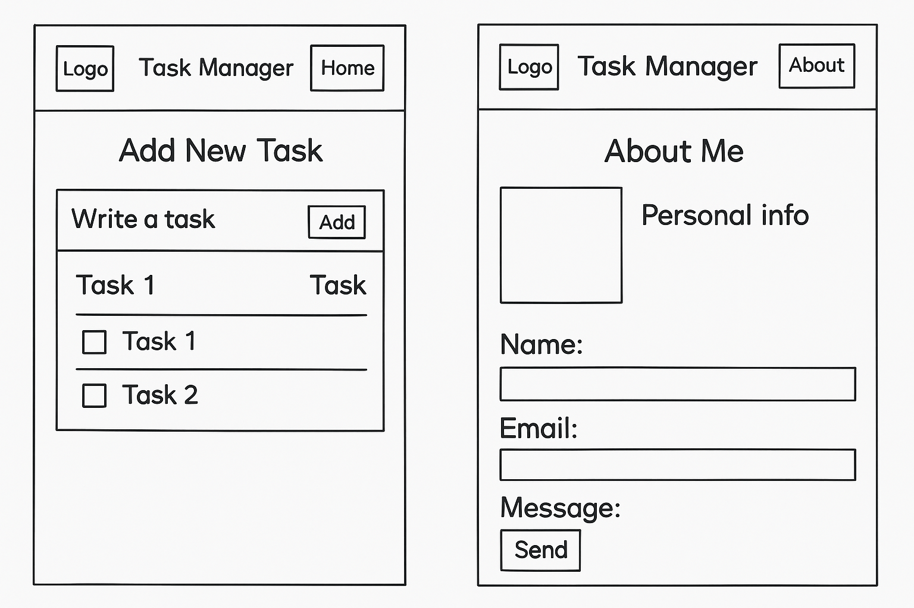

# My Tasks

This project is a simple Task Manager Website created using **HTML** and **CSS** as part of Lab 2.

---

## 📷 Wireframe

Below is the wireframe that shows the layout of the two pages (Home and About):

---

## 💡 What I learned from this lab

- I learned how to build a basic website using HTML and CSS.
- I practiced using Flexbox to align elements in the header.
- I designed two pages: `index.html` and `about.html`.

---

## ⏱️ How long did it take?

I expected the lab to take around **2 to 3 hours**,  
but unfortunately, it took more time because the requirements were not very clear at the beginning.  
Once I understood the tasks, it became easier to complete.
